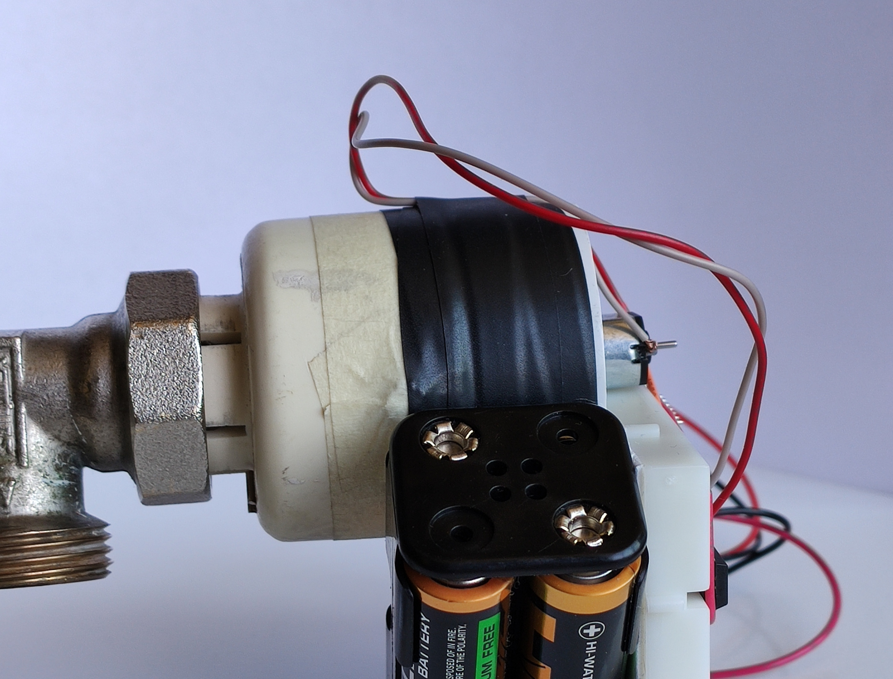
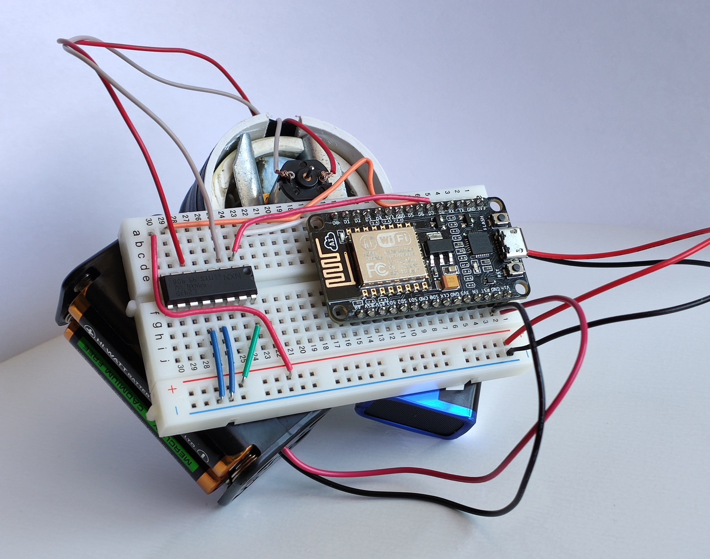
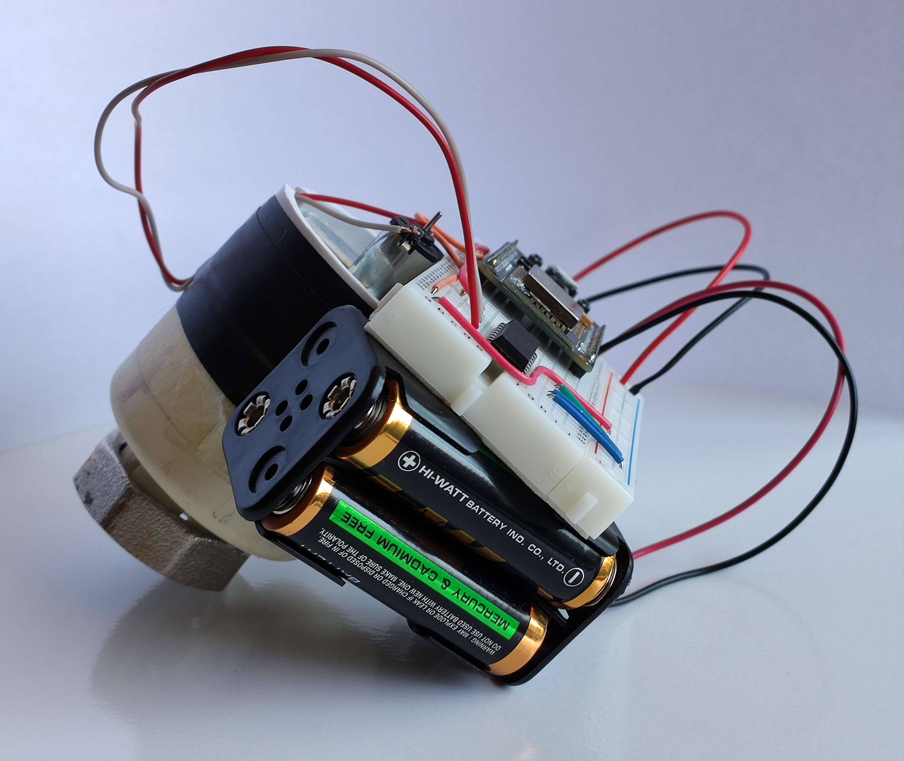
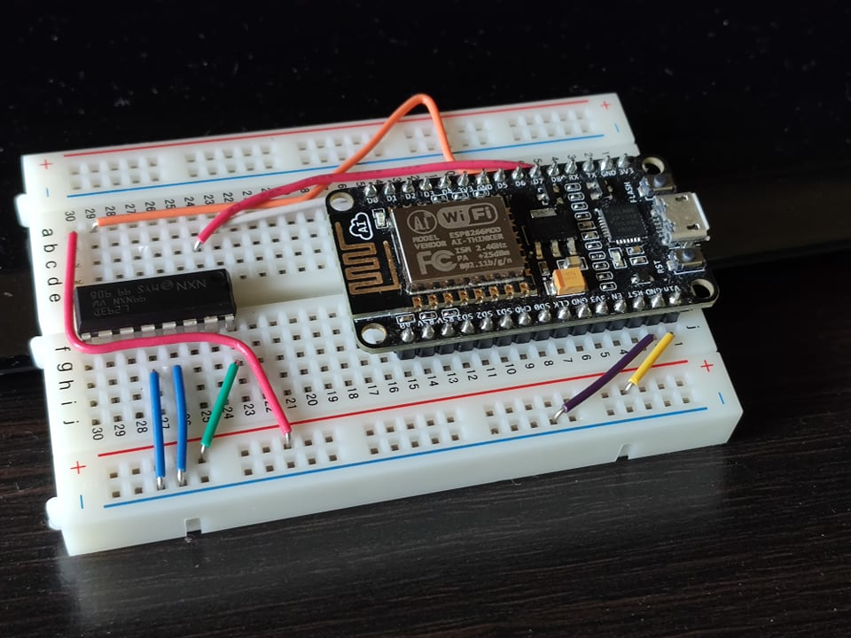

# SmartParno
## Short Description:

**EN:** SmartParno is a device which allows you to control your central heating system (a.k.a. _parno_) from any point of the world! It uses Wi-Fi to communicate with your smartphone. Our new innovative technology, uses thermal sensors for feedback and allows you to set the _parno_ to an exact temperature. We can safely say that SmartParno does not only make your heating remote controlled, but it makes it more precise too!  

**BG:** SmartParno е устройство, което ви позволява да управялвате вашето парното от всяка точка на света! Използва Wi-Fi връзка, за да комуникира с вашия смартфон. Нашата иновативна технология използва термо сензори, чрез които можете да настроите парното си на точна температура. Смело можем да заявим, че SmartParno прави парното ви по-прецизно и по-лесно за използване и то от всяка точка на земята!  

## All features:
- Turn the _parno_ on the power scale from 1 to 5
- Set an exact temperature, which the _parno_ will maintain
- Show the current temperature of the _parno_
- Get notified when the device is low on battery (not yet implemented)

## Technical details
SmartParno is a two-part project: a physical device and a mobile application. The device uses a NodeMCU ESP8266 to connect to the local network and communicate with the application via Wi-Fi. For physically turning ON and OFF the _parno_,  we use a custom-made mechanism and a 3-6V DC motor with a gearbox for increased torque. The motor is controlled by the ESP via an L293D shield. Everything is powered by a 5V battery pack.

Links to datasheets:
1) NodeMCU ESP8266 - https://components101.com/development-boards/nodemcu-esp8266-pinout-features-and-datasheet
2) L932D motor shield - https://www.ti.com/lit/ds/symlink/l293.pdf

  
This is the 4th generation prototype and how it looks like, when connected to the _parno_.  

  
ALl of these electronics will be made into a custom made board, which will be 5 times smaller.  

  
We are also going to order a set of baterries, which will exactly satisfy our needs, and will also be much much smaller.

  
This is the most compact version on the breadboard. Everything gets powered by 4 3A batteries, which connect on the power rail that is closer to you.  

## Challenges

#### Our first question was: How do we make a motor turn a _parno_ ON and OFF?
I. After a few days of thinking we settled down on a custom 3D printed mechanism with a stepper motor attatched to one side and the _parno's_ valve on the other. After 3 generations of custom-made models we came to the conclusion, that this is unrealistic, because the valve is very robust and it is impossible to push it with some janky plastic pieces.  
II. Plan B was the so called linear actuator, which would for sure have enough power to push the valve. The problems with these things are that they are 1.Big and 2.Expensive. The ones available for sale in Bulgaria were some industrial actuators, used in trucks and other big machines. In China there were some smaller actuators, but the prices varied between $80 and $200 and on top of that, they would take a few weeks/months to get delivered to Bulgaria.  
III. We then started developing our own mechanism, very similiar to a real linear actuator, but with some changes in order to make it smaller. After 4 generations of custom-built mechanisms, we created the one, that you see in our DEMO video. It is far from perfect, but combined with a gearbox and a 3-6V DC motor it has the needed torque to fully push every _parno's_ valve!  

#### The second problem we had to solve was: How do we control this mechanism remotely?
The answer was obvious: Wi-Fi.
Because Kris Vassikov had previous experience with Wi-Fi communication we knew exactly what to do. We bought a brand new NodeMCU ESP8266 and started experimenting with it. After a research we decided to use a program called Blynk to take care of the server-side. Later we decided to change this up, because it dind't fully fulfill our needs.

#### But how do we power all of this???
I. First we wanted to use a power outlet, but decided that this is not a good choice, since it would require a power outlet to be close to the _parno_, which is very inconvenient.
II. The other and more valid option was to use batteries. Right now SmartParno is powered by 4 3A Batteries, but we have not yet tested how much the battery life is.
